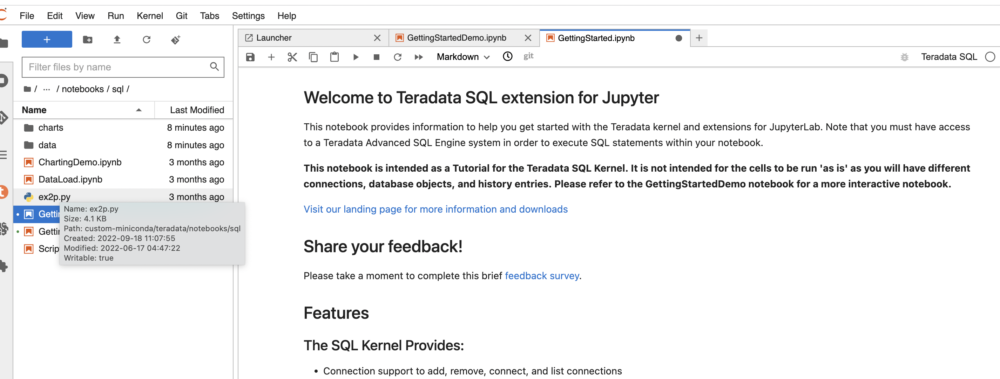

import ClearscapeDocsNote from '../_partials/vantage_clearscape_analytics.mdx'
import JupyterClearScapeNote from '../_partials/jupyter_notebook_clearscape_analytics_note.mdx';

# Integrate Teradata Jupyter extensions with SageMaker notebook instance


<JupyterClearScapeNote />

### Overview
Teradata Jupyter extensions provide Teradata SQL kernel and several UI extensions to allow users to easily asccess and navigate Teradata database from Jupyter envioronment. This article describes how to integate our Jupyter extensions with SageMaker notebook instance.

### Prerequisites


* Access to a Teradata Vantage instance
  <ClearscapeDocsNote />
* AWS account
* AWS S3 bucket to store lifecycle configuration scripts and Teradata Jupyter extension package

### Integration

SageMaker supports customization of notebook instances using lifecycle configuration scripts. Below we will demo how to use lifecycle configuration scripts to install our Jupyter kernel and extensions in a notebook instance.

### Steps to integrate with notebook instance

1. Download Teradata Jupyter extensions package

Download Linux version from https://downloads.teradata.com/download/tools/vantage-modules-for-jupyter and upload it to an S3 bucket. This zipped package contains Teradata Jupyter kernel and extensions. Each extension has 2 files, the one with "_prebuilt" in the name is prebuilt extension which can be installed using PIP, the other one is source extension that needs to be installed using "jupyter labextension". It is recommended to use prebuilt extensions.

2. Create a lifecycle configuration for notebook instance


Here are sample scripts that fetches the Teradata package from S3 bucket and installs Jupyter kernel and extensions. Note that on-create.sh creates a custom conda env that persists on notebook instance's EBS volume so that the installation will not get lost after notebook restarts. on-start.sh installs Teradata kernel and extensions to the custom conda env.

on-create.sh

``` bash , role="content-editable
#!/bin/bash
 
set -e
 
# This script installs a custom, persistent installation of conda on the Notebook Instance's EBS volume, and ensures
# that these custom environments are available as kernels in Jupyter.
 
 
sudo -u ec2-user -i <<'EOF'
unset SUDO_UID
# Install a separate conda installation via Miniconda
WORKING_DIR=/home/ec2-user/SageMaker/custom-miniconda
mkdir -p "$WORKING_DIR"
wget https://repo.anaconda.com/miniconda/Miniconda3-4.6.14-Linux-x86_64.sh -O "$WORKING_DIR/miniconda.sh"
bash "$WORKING_DIR/miniconda.sh" -b -u -p "$WORKING_DIR/miniconda"
rm -rf "$WORKING_DIR/miniconda.sh"
# Create a custom conda environment
source "$WORKING_DIR/miniconda/bin/activate"
KERNEL_NAME="teradatasql"
 
PYTHON="3.8"
conda create --yes --name "$KERNEL_NAME" python="$PYTHON"
conda activate "$KERNEL_NAME"
pip install --quiet ipykernel
 
EOF
```


on-start.sh

``` bash , role="content-editable"
#!/bin/bash
 
set -e
 
# This script installs Teradata Jupyter kernel and extensions.
 
 
sudo -u ec2-user -i <<'EOF'
unset SUDO_UID
 
WORKING_DIR=/home/ec2-user/SageMaker/custom-miniconda
 
source "$WORKING_DIR/miniconda/bin/activate" teradatasql
 
# fetch Teradata Jupyter extensions package from S3 and unzip it
mkdir -p "$WORKING_DIR/teradata"
aws s3 cp s3://sagemaker-teradata-bucket/teradatasqllinux_3.3.0-ec06172022.zip "$WORKING_DIR/teradata"
cd "$WORKING_DIR/teradata"
 
unzip -o teradatasqllinux_3.3.0-ec06172022.zip
 
# install Teradata kernel
cp teradatakernel /home/ec2-user/anaconda3/condabin
jupyter kernelspec install --user ./teradatasql
 
# install Teradata Jupyter extensions
source /home/ec2-user/anaconda3/bin/activate JupyterSystemEnv
 
pip install teradata_connection_manager_prebuilt-3.3.0.tar.gz
pip install teradata_database_explorer_prebuilt-3.3.0.tar.gz
pip install teradata_preferences_prebuilt-3.3.0.tar.gz
pip install teradata_resultset_renderer_prebuilt-3.3.0.tar.gz
pip install teradata_sqlhighlighter_prebuilt-3.3.0.tar.gz
 
conda deactivate
EOF
```

3. Create a notebook instance. Please select 'Amazon Linux 2, Jupyter Lab3' for Platform identifier and select the lifecycle configuration created in step 2 for Lifecycle configuration.

    

You might also need to add vpc, subnet and security group in 'Network' section to gain access to Teradata databases.

4. Wait until notebook instance Status turns 'InService', click 'Open JupyterLab' to open the notebook.
    


    Access the demo notebooks to get usage tips
    


### Further reading
* [Teradata Jupyter Extensions Website](https://teradata.github.io/jupyterextensions)
* [Teradata Vantage™ Modules for Jupyter Installation Guide](https://docs.teradata.com/r/KQLs1kPXZ02rGWaS9Ktoww/root)
* [Teradata® Package for Python User Guide](https://docs.teradata.com/r/1YKutX2ODdO9ppo_fnguTA/root)
* [Customize a Notebook Instance Using a Lifecycle Configuration Script](https://docs.aws.amazon.com/sagemaker/latest/dg/notebook-lifecycle-config.html)
* [amazon sagemaker notebook instance lifecycle config samples](https://github.com/aws-samples/amazon-sagemaker-notebook-instance-lifecycle-config-samples/blob/master/scripts/persistent-conda-ebs/on-create.sh)

import CommunityLinkPartial from '../_partials/community_link.mdx';

<CommunityLinkPartial />
