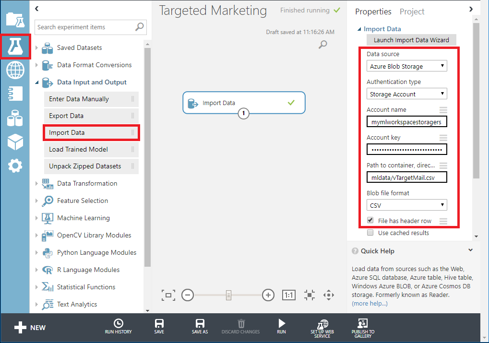
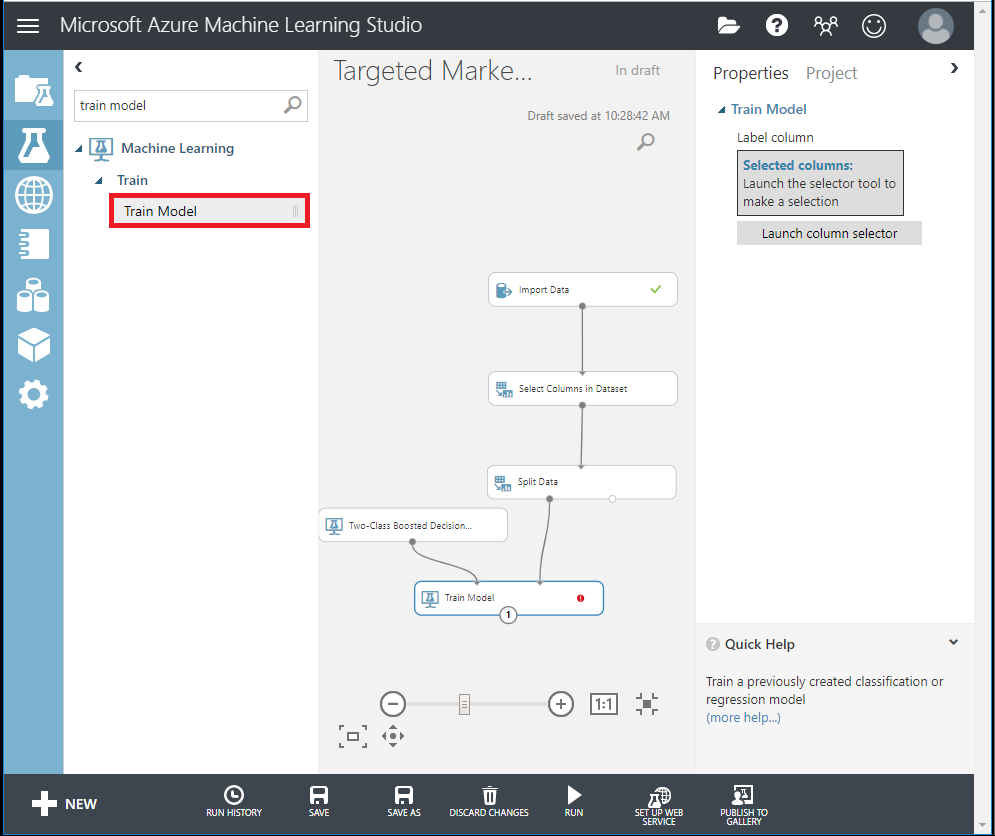
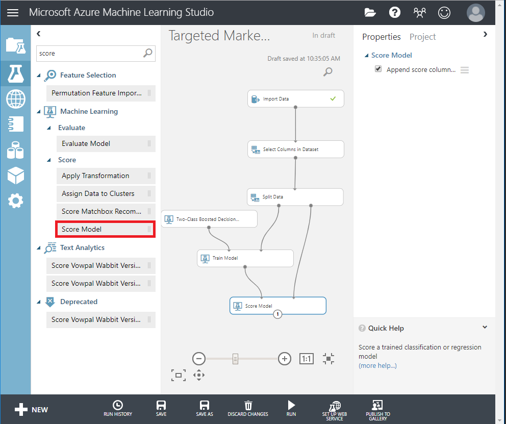

# Use Teradata Vantage with Azure Machine Learning Studio

### Overview

[Azure Machine Learning (ML) Studio](https://docs.microsoft.com/en-us/azure/machine-learning/studio/what-is-ml-studio) is a collaborative, drag-and-drop tool you can use to build, test, and deploy predictive analytics solutions on your data. ML Studio can consume data from Azure Blob Storage. This getting started guide will show how you can copy Teradata Vantage data sets to a Blob Storage using ML Studio 'built-in' Jupter Notebook feature. The data can then be used by ML Studio to build and train machine learning models and deploy them into a production environment.


### Prerequisites

import ClearscapeDocsNote from '../_partials/vantage_clearscape_analytics.mdx'

* Access to a Teradata Vantage instance.
  <ClearscapeDocsNote />
* Azure subscription or create [free account](https://azure.microsoft.com/free)
* [Azure ML Studio workspace](https://docs.microsoft.com/en-us/azure/machine-learning/studio/create-workspace)
* (Optional) Download [AdventureWorks DW 2016 database](https://docs.microsoft.com/en-us/sql/samples/adventureworks-install-configure?view=sql-server-2017) (i.e. _'Training the Model'_ section)
** Restore and copy _'vTargetMail'_ table from SQL Server to Teradata Vantage


### Procedure

### Initial setup


* During ML Studio workspace creation, you may need to create 'new' storage account unless you have one in current availability locations and choose *DEVTEST Standard* for *Web service plan* for this getting started guide. Logon to [Azure portal](https://portal.azure.com), open your storage account and create a *container* if one does not exist already.


* Copy your *storage account name* and *key* to notepad which we will use for Python3 Notebook to access your Azure Blob Storage account.


* Finally, open *Configuration* property and set *_'Secure transfer required'_* to *_Disabled_* to allow ML Studio Import Data module to access blob storage account.


### Load data

To get the data to ML Studio, we first need to load data from Teradata Vantage to a Azure Blob Storage. We will create a ML Jupyter Notebook, install Python packages to connect to Teradata and save data to Azure Blob Storage,

Logon to [Azure portal](https://portal.azure.com), go to to your *ML Studio workspace* and [Launch Machine Learning Studio](https://studio.azureml.net) and *Sign In.*

1. You should see the following screen and click on *Notebooks,* ensure you are in the right region/ workspace and click on Notebook *New*


2. Choose *Python3* and *name* your notebook instance


3. In your jupyter notebook instance, install [Teradata Vantage Python package for Advanced Analytics](https://pypi.org/project/teradataml):
+
``` python
pip install teradataml
```
+
:::note
There is no validation between Microsoft Azure ML Studio and Teradata Vantage Python package.
:::

4. Install [Microsoft Azure Storage Blob Client Library for Python](https://pypi.org/project/azure-storage-blob):
+
``` python
!pip install azure-storage-blob
```

5. Import the following libraries:
+
``` python
import teradataml as tdml
from teradataml import create_context, get_context, remove_context
from teradataml.dataframe.dataframe import DataFrame
import pandas as pd
from azure.storage.blob import (BlockBlobService)
```

6. Connect to Teradata using command:
+
``` python
create_context(host = '<hostname>', username = '<database user name>', password = '<password>')
```

7. Retrieve Data using Teradata Python DataFrame module:
+
``` python
train_data = DataFrame.from_table("<table_name>")
```

8. Convert Teradata DataFrame to Panda DataFrame:
+
``` python
trainDF = train_data.to_pandas()
```

9. Convert data to CSV:
+
``` python
trainDF = trainDF.to_csv(head=True,index=False)
```

10. Assign variables for Azue Blob Storage account name, key and container name:
+
``` python
accountName="<account_name>"
accountKey="<account_key>"
containerName="mldata"
```

11. Upload file to Azure Blob Storage:
+
``` python , id="azure_ml_studio_first_config", role="content-editable emits-gtm-events
blobService = BlockBlobService(account_name=accountName, account_key=accountKey)
blobService.create_blob_from_text(containerNAme, 'vTargetMail.csv', trainDF)
```

12. Logon to Azure portal, open blob storage account to view uploaded file:


### Train the model

We will use the existing [Analyze data with Azure Machine Learning](https://docs.microsoft.com/en-us/azure/sql-data-warehouse/sql-data-warehouse-get-started-analyze-with-azure-machine-learning) article to build a predictive machine learning model based on data from Azure Blob Storage. We will build a targeted marketing campaign for Adventure Works, the bike shop, by predicting if a customer is likely to buy a bike or not.

#### Import data

The data is on Azure Blob Storage file called `vTargetMail.csv` which we copied in the section above.

1.. Sign into [Azure Machine Learning studio](https://studio.azureml.net) and click on *Experiments*.
2.. Click *+NEW* on the bottom left of the screen and select *Blank Experiment*.
3.. Enter a name for your experiment: Targeted Marketing.
4.. Drag *Import data* module under *Data Input and output* from the modules pane into the canvas.
5.. Specify the details of your Azure Blob Storage (account name, key and container name) in the Properties pane.

Run the experiment by clicking *Run* under the experiment canvas.



After the experiment finishes running successfully, click the output port at the bottom of the Import Data module and select *Visualize* to see the imported data.


#### Clean the data

To clean the data, drop some columns that are not relevant for the model. To do this:

1. Drag *Select Columns in Dataset* module under *Data Transformation < Manipulation* into the canvas. Connect this module to the *Import Data* module.
2. Click *Launch column selector* in Properties pane to specify which columns you wish to drop.

3. Exclude two columns: *CustomerAlternateKey* and *GeographyKey*.


#### Build the model

We will split the data 80-20: 80% to train a machine learning model and 20% to test the model. We will make use of the "Two-Class" algorithms for this binary classification problem.

1. Drag *SplitData* module into the canvas and connect with 'Select Columns in DataSet'.
2. In the properties pane, enter 0.8 for Fraction of rows in the first output dataset.


3. Search and drag *Two-Class Boosted Decision Tree* module into the canvas.
4. Search and drag *Train Model* module into the canvas and specify inputs by connecting it to the *Two-Class Boosted Decision Tree* (ML algorithm) and *Split* *Data* (data to train the algorithm on) modules.


5. Then, click *Launch column selector* in the Properties pane. Select the *BikeBuyer* column as the column to predict.


#### Score the model

Now, we will test how the model performs on test data. We will compare the algorithm of our choice with a different algorithm to see which performs better.

1. Drag *Score Model* module into the canvas and connect it to *Train Model* and *Split Data* modules.
+



2. Search and drag *Two-Class Bayes Point Machine* into the experiment canvas. We will compare how this algorithm performs in comparison to the Two-Class Boosted Decision Tree.
3. Copy and Paste the modules Train Model and Score Model in the canvas.
4. Search and drag *Evaluate Model* module into the canvas to compare the two algorithms.
5. *Run* the experiment.

6. Click the output port at the bottom of the Evaluate Model module and click Visualize.


The metrics provided are the ROC curve, precision-recall diagram and lift curve. Looking at these metrics, we can see that the first model performed better than the second one. To look at the what the first model predicted, click on output port of the Score Model and click Visualize.


You will see two more columns added to your test dataset.
1. Scored Probabilities: the likelihood that a customer is a bike buyer.
2. Scored Labels: the classification done by the model - bike buyer (1) or not (0). This probability threshold for labeling is set to 50% and can be adjusted.

Comparing the column BikeBuyer (actual) with the Scored Labels (prediction), you can see how well the model has performed. As next steps, you can use this model to make predictions for new customers and publish this model as a web service or write results back to SQL Data Warehouse.

### Further reading

* To learn more about building predictive machine learning models, refer to [+++Introduction to Machine Learning on Azure+++](https://azure.microsoft.com/documentation/articles/machine-learning-what-is-machine-learning).
* For large data set copies, consider using the [Teradata Access Module for Azure](https://docs.teradata.com/reader/p~0sSD4zl4K8YPbEGnM3Rg/TTu_WJMMIpo2TEaxFMFopQ) that interfaces between the Teradata Parallel Transporter load/unload operators and Azure Blob Storage.

import CommunityLinkPartial from '../_partials/community_link.mdx';

<CommunityLinkPartial />
