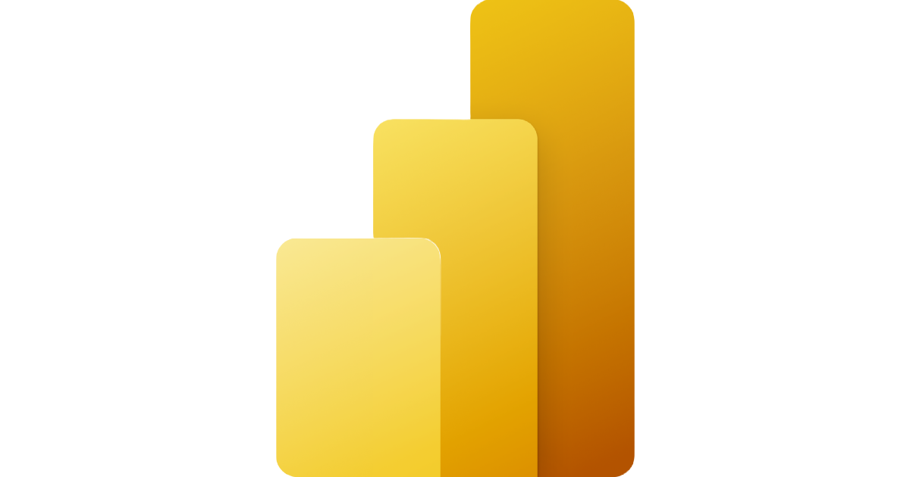
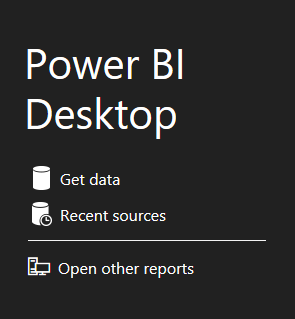
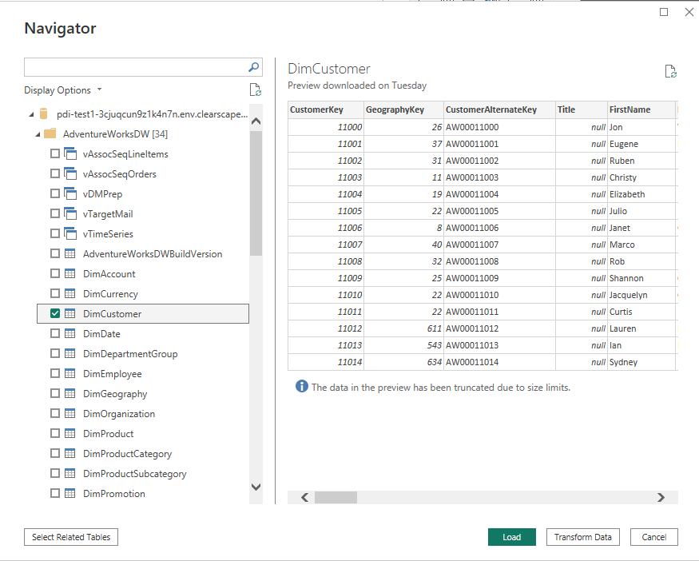

# Create Vizualizations in Power BI using Vantage

### Overview

:::note
This guide includes content from both Microsoft and Teradata product documentation.
:::

This article describes the process to connect your Power BI Desktop to Teradata Vantage for creating reports and dramatic visualizations of your data.  Power BI supports Teradata Vantage as a data source and can use the underlying data just like any other data source in Power BI Desktop.

[Power BI](https://docs.microsoft.com/en-us/power-bi/power-bi-overview) is a collection of software services, applications, and connectors that work together to turn your unrelated sources of data into coherent, visually immersive, and interactive insights.

.Power BI consists of:
* A Windows desktop application, called [Power BI Desktop](https://docs.microsoft.com/en-us/power-bi/fundamentals/desktop-what-is-desktop)
* An online SaaS (Software as a Service) service, called the [Power BI service](https://docs.microsoft.com/en-us/power-bi/fundamentals/power-bi-service-overview)
* [Power BI mobile](https://docs.microsoft.com/en-us/power-bi/consumer/mobile/mobile-apps-for-mobile-devices) apps for Windows, iOS, and Android devices

These three elements—Power BI Desktop, the Power BI service, and the mobile apps—are designed to let people create, share, and consume business insights in the way that serves them, or their role, most effectively.

A fourth element, [Power BI Report Server](https://docs.microsoft.com/en-us/power-bi/report-server/get-started), allows you to publish Power BI reports to an on-premises report server, after creating them in Power BI Desktop.

Power BI Desktop supports Vantage as a 3rd party data source not as a ‘native’ data source.  Instead, published reports on Power BI service will need to use the [on-premises data gateway](https://docs.microsoft.com/en-us/power-bi/connect-data/service-gateway-onprem) component to access Vantage.

This getting started guide will show you how to connect to a Teradata Vantage. Power BI Desktop Teradata connector uses the [.NET Data Provider for Teradata](https://downloads.teradata.com/download/connectivity/net-data-provider-for-teradata). You need to install the driver on computers that use the Power BI Desktop. The .NET Data Provider for Teradata single installation supports both 32-bit or 64-bit Power BI Desktop application.

### Prerequisites
You are expected to be familiar with Azure services, Teradata Vantage, and Power BI Desktop.

You will need the following accounts and system.

* The Power BI Desktop is a free application for Windows. (Power BI Desktop is not available for Macs. You could run it in a virtual machine, such as [Parallels](https://www.parallels.com) or [VMware Fusion](https://www.vmware.com/products/fusion.html), or in Apple’s [Boot Camp](https://support.apple.com/en-vn/boot-camp), but that is beyond the scope of this article.)

* A Teradata Vantage instance with a user and password. The user must have permission to data that can be used by Power BI Desktop. Vantage must be accessible from Power BI Desktop.
+
import ClearscapeDocsNote from '../_partials/vantage_clearscape_analytics.md'

<ClearscapeDocsNote />

* The [.NET Data Provider for Teradata](https://downloads.teradata.com/download/connectivity/net-data-provider-for-teradata).

### Getting Started
### Install Power BI Desktop
You can install Power BI Desktop from the [Microsoft Store](https://aka.ms/pbidesktopstore) or [download the installer](https://aka.ms/pbiSingleInstaller) and run it directly.

### Install the .NET Data Provider for Teradata
Download and install the latest version of the [.NET Data Provider for Teradata](https://downloads.teradata.com/download/connectivity/net-data-provider-for-teradata).

Note that there are multiple files available for download. You want the file that starts with “tdnetdp”.

### Connect to Teradata Vantage
* Run Power BI Desktop, which has a yellow icon. 

* If the opening (splash) screen is showing, click on Get data.

Otherwise, if you are in the main form of Power BI, ensure that you are on the _Home_ ribbon and click on _Get data_. Click on _More…_.

* Click on _Database_ on the left.
* Scroll the list on the right until you see _Teradata database_. Click on _Teradata database_, and then click on the _Connect_ button.

(“Teradata database” and “Teradata Vantage” are synonymous in this article.)

* In the window that appears, enter the name or IP address of your Vantage system into the text box. You can choose to _Import_ data directly into Power BI data model, or connect directly to the data source using [DirectQuery](https://docs.microsoft.com/en-us/power-bi/desktop-use-directquery) and click _OK_.

(Click _Advanced_ options to submit hand-crafted SQL statement.)

For credentials, you have the option of connecting with your _Windows_ login or _Database_ username defined in Vantage, which is more common. Select the appropriate    authentication method and enter in your username and password. Click _Connect_.

You also have the option of authenticating with an LDAP server. This option is hidden by default.

If you set the environment variable, _PBI_EnableTeradataLdap_, to _true_, then the LDAP authentication method will become available.

Do note that LDAP is not supported with the on-premises data gateway, which is used for reports that are published to the Power BI service. If you need LDAP authentication and are using the on-premises data gateway, you will need to submit an incident to Microsoft and request support.

Alternatively, you can [configure Kerberos-based SSO from Power BI service to on-premise data sources](https://docs.microsoft.com/en-us/power-bi/connect-data/service-gateway-sso-kerberos) like Teradata.

Once you have connected to the Vantage system, Power BI Desktop remembers the credentials for future connections to the system. You can modify these credentials by going to _File > Options and settings > Data source settings_.

The Navigator window appears after a successful connection. It displays the data available on the Vantage system. You can select one or more elements to use in Power BI Desktop.

You preview a table by clicking on its name. If you want to load it into Power BI Desktop, ensure that you click the checkbox next to the table name.

You can _Load_ the selected table, which brings it into Power BI Desktop. You can also _Edit_ the query, which opens a query editor so you can filter and refine the set of data you want to load.

_Edit_ may be called _Transform data_, depending upon the version of Power BI Desktop that you have.

For information on joining tables, see [Create and Manage Relationships in Power BI Desktop](https://docs.microsoft.com/en-us/power-bi/desktop-create-and-manage-relationships) feature.

To publish your report, click _Publish_ on _Home_ ribbon in Power BI Desktop.

Power BI Desktop will prompt you to save your report. Choose _My workspace_ and click _Select_. 

Once report has been published, click _Got it_ to close. You may also click the link, which has the report name in the link.

This is an example of a report created in Power BI Desktop.

### Next steps
You can combine data from many sources with Power BI Desktop. Look at the following links for more information.

* [What is Power BI Desktop?](https://docs.microsoft.com/en-us/power-bi/desktop-what-is-desktop)
* [Data Sources in Power BI Desktop](https://docs.microsoft.com/en-us/power-bi/desktop-data-sources)
* [Shape and Combine Data with Power BI Desktop](https://docs.microsoft.com/en-us/power-bi/desktop-shape-and-combine-data)
* [Connect to Excel workbooks in Power BI Desktop](https://docs.microsoft.com/en-us/power-bi/desktop-connect-excel)
* [Enter data directly into Power BI Desktop](https://docs.microsoft.com/en-us/power-bi/desktop-enter-data-directly-into-desktop)

import CommunityLinkPartial from '../_partials/community_link.md';

<CommunityLinkPartial />
