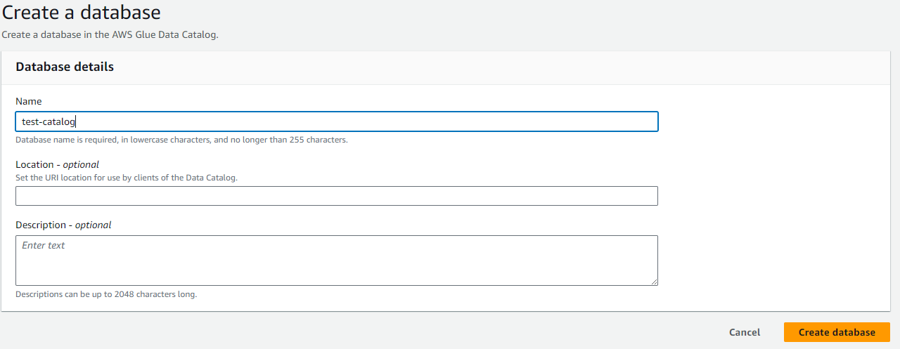
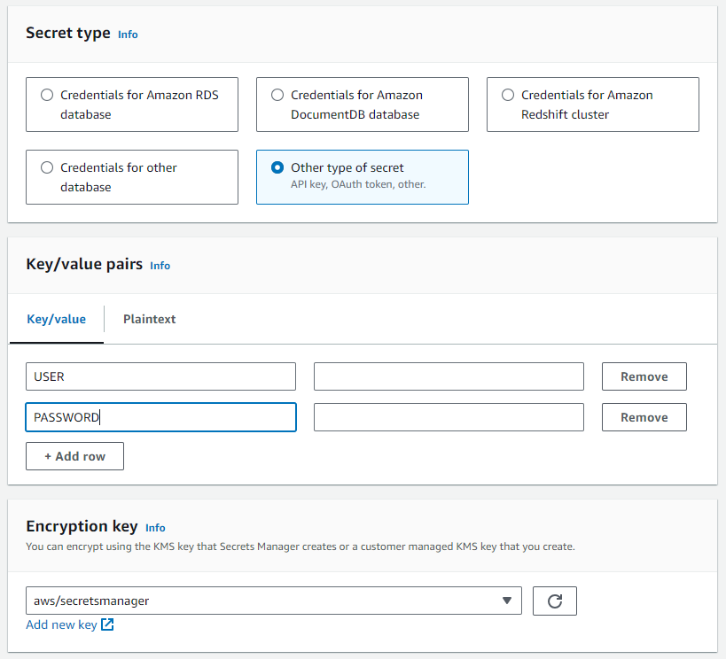
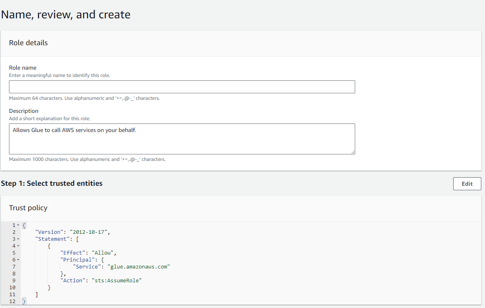
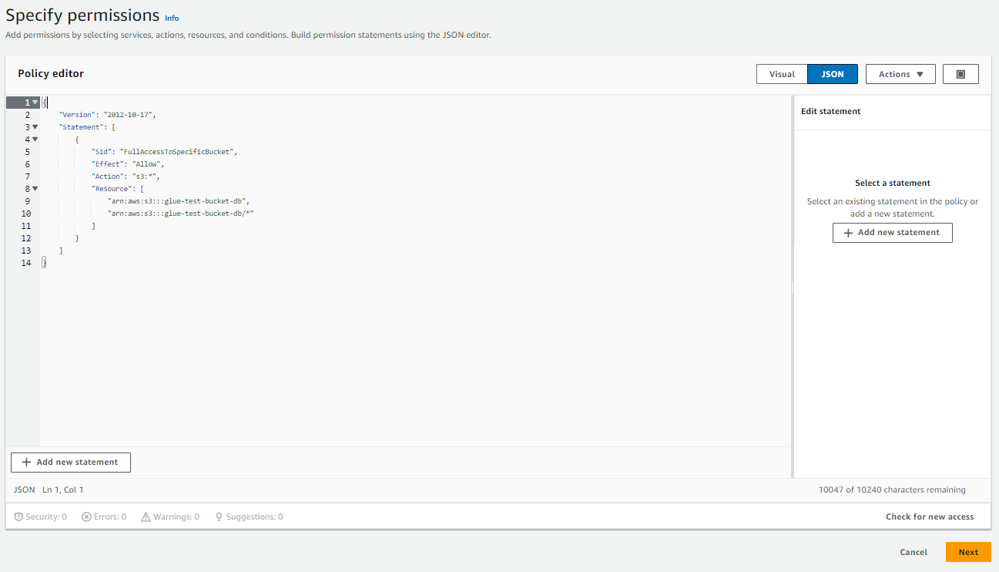
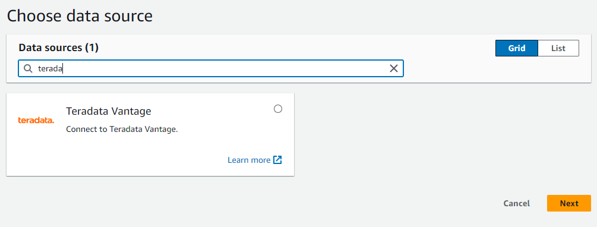
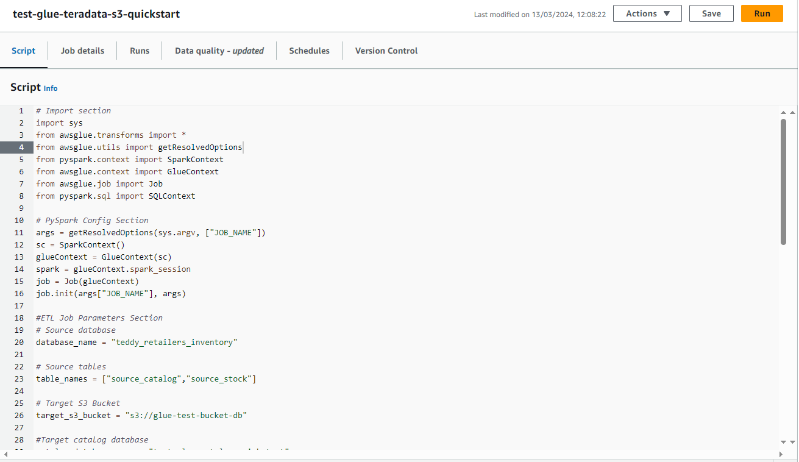

# Ingest and Catalog Data from Teradata Vantage to Amazon S3 with AWS Glue Scripts

### Overview
This quickstart details the process of ingesting and cataloging data from Teradata Vantage to Amazon S3 with AWS Glue. 

:::tip
For ingesting data to Amazon S3 when cataloging is not a requirement consider [Teradata Write NOS capabilities](https://docs.teradata.com/r/Enterprise_IntelliFlex_VMware/SQL-Data-Manipulation-Language/Working-with-External-Data/WRITE_NOS).
:::


### Prerequisites

import ClearscapeDocsNote from '../_partials/vantage_clearscape_analytics.md'

* Access to an [Amazon AWS account](https://aws.amazon.com)
* Access to a Teradata Vantage instance
  <ClearscapeDocsNote />
* A database [client](https://quickstarts.teradata.com/other-integrations/configure-a-teradata-vantage-connection-in-dbeaver.html) to send queries for loading the test data

### Loading of test data
* In your favorite database client run the following queries
+
``` sql
CREATE DATABASE teddy_retailers_inventory
AS PERMANENT = 110e6;

CREATE TABLE teddy_retailers_inventory.source_catalog AS
(
  SELECT product_id, product_name, product_category, price_cents
    FROM (
		LOCATION='/s3/dev-rel-demos.s3.amazonaws.com/demo-datamesh/source_products.csv') as products
) WITH DATA;

CREATE TABLE teddy_retailers_inventory.source_stock AS
(
  SELECT entry_id, product_id, product_quantity, purchase_price_cents, entry_date
    FROM (
		LOCATION='/s3/dev-rel-demos.s3.amazonaws.com/demo-datamesh/source_stock.csv') as stock
) WITH DATA;
```

### Amazon AWS setup
In this section, we will cover in detail each of the steps below:

* Create an Amazon S3 bucket to ingest data
* Create an AWS Glue Catalog Database for storing metadata
* Store Teradata Vantage credentials in AWS Secrets Manager
* Create an AWS Glue Service Role to assign to ETL jobs
* Create a connection to a Teradata Vantage Instance in AWS Glue
* Create an AWS Glue Job
* Draft a script for automated ingestion and cataloging of Teradata Vantage data into Amazon S3

### Create an Amazon S3 Bucket to Ingest Data
* In Amazon S3, select `Create bucket`.

* Assign a name to your bucket and take note of it.

* Leave all settings at their default values.
* Click on `Create bucket`.


### Create an AWS Glue Catalog Database for Storing Metadata

* In AWS Glue, select Data catalog, Databases.
* Click on `Add database`.

* Define a database name and click on `Create database`.


### Store Teradata Vantage credentials in AWS Secrets Manager

* In AWS Secrets Manager, select `Create new secret`.

* The secret should be an `Other type of secret` with the following keys and values according to your Teradata Vantage Instance:
** USER
** PASSWORD
:::tip
In the case of ClearScape Analytics Experience, the user is always "demo_user," and the password is the one you defined when creating your ClearScape Analytics Experience environment.
:::

* Assign a name to the secret.
* The rest of the steps can be left with the default values.
* Create the secret.

### Create an AWS Glue Service Role to Assign to ETL Jobs
The role you create should have access to the typical permissions of a Glue Service Role, but also access to read the secret and S3 bucket you've created.

* In AWS, go to the IAM service.
* Under Access Management, select `Roles`.
* In roles, click on `Create role`.

* In select trusted entity, select `AWS service` and pick `Glue` from the dropdown.

* In add permissions:
** Search for `AWSGlueServiceRole`.
** Click the related checkbox.
** Search for `SecretsManagerReadWrite`.
** Click the related checkbox.
* In Name, review, and create:
** Define a name for your role.

* Click on `Create role`.
* Return to Access Management, Roles, and search for the role you've just created.
* Select your role.
* Click on `Add permissions`, then `Create inline policy`.
* Click on `JSON`.
* In the Policy editor, paste the JSON object below, substituting the name of the bucket you've created.
``` json
{
    "Version": "2012-10-17",
    "Statement": [
        {
            "Sid": "FullAccessToSpecificBucket",
            "Effect": "Allow",
            "Action": "s3:*",
            "Resource": [1
                "arn:aws:s3:::<bucket-name>",
                "arn:aws:s3:::<bucket-name>/*"
            ]
        }
    ]
}
```
* Click `Next`.

* Assign a name to your policy.
* Click on `Create policy`.

### Create a connection to a Teradata Vantage Instance in AWS Glue

* In AWS Glue, select `Data connections`.

* Under Connectors, select `Create connection`.
* Search for and select the Teradata Vantage data source.

* In the dialog box, enter the URL of your Teradata Vantage instance in JDBC format.
:::tip
In the case of ClearScape Analytics Experience, the URL follows the following structure: 
`jdbc:teradata://<URL Host>/DATABASE=demo_user,DBS_PORT=1025`
:::
* Select the AWS Secret created in the previous step.
* Name your connection and finish the creation process.


### Create an AWS Glue Job
* In AWS Glue, select `ETL Jobs` and click on `Script editor`.

* Select `Spark` as the engine and choose to start fresh.


### Draft a script for automated ingestion and cataloging of Teradata Vantage data into Amazon S3

* Copy the following script into the editor.
** The script requires the following modifications:
*** Substitute the name of your S3 bucket.
*** Substitute the name of your Glue catalog database.
*** If you are not following the example in the guide, modify the database name and the tables to be ingested and cataloged.
*** For cataloging purposes, only the first row of each table is ingested in the example. This query can be modified to ingest the whole table or to filter selected rows.

``` python , id="glue-script-first-run" role="emits-gtm-events"
# Import section
import sys
from awsglue.transforms import *
from awsglue.utils import getResolvedOptions
from pyspark.context import SparkContext
from awsglue.context import GlueContext
from awsglue.job import Job
from pyspark.sql import SQLContext

# PySpark Config Section
args = getResolvedOptions(sys.argv, ["JOB_NAME"])
sc = SparkContext()
glueContext = GlueContext(sc)
spark = glueContext.spark_session
job = Job(glueContext)
job.init(args["JOB_NAME"], args)

#ETL Job Parameters Section
# Source database
database_name = "teddy_retailers_inventory"

# Source tables
table_names = ["source_catalog","source_stock"]

# Target S3 Bucket
target_s3_bucket = "s3://<your-bucket-name>"

#Target catalog database 
catalog_database_name = "<your-catalog-database-name>" 


# Job function abstraction
def process_table(table_name, transformation_ctx_prefix, catalog_database, catalog_table_name):
    dynamic_frame = glueContext.create_dynamic_frame.from_options(
        connection_type="teradata",
        connection_options={
            "dbtable": table_name,
            "connectionName": "Teradata connection default",
            "query": f"SELECT TOP 1 * FROM {table_name}", # This line can be modified to ingest the full table or rows that fulfill an specific condition
        },
        transformation_ctx=transformation_ctx_prefix + "_read",
    )

    s3_sink = glueContext.getSink(
        path=target_s3_bucket,
        connection_type="s3",
        updateBehavior="UPDATE_IN_DATABASE",
        partitionKeys=[],
        compression="snappy",
        enableUpdateCatalog=True,
        transformation_ctx=transformation_ctx_prefix + "_s3",
    )
    # Dynamically set catalog table name based on function parameter
    s3_sink.setCatalogInfo(
        catalogDatabase=catalog_database, catalogTableName=catalog_table_name
    )
    s3_sink.setFormat("csv")
    s3_sink.writeFrame(dynamic_frame)


# Job execution section
for table_name in table_names:
    full_table_name = f"{database_name}.{table_name}"  
    transformation_ctx_prefix = f"{database_name}_{table_name}"  
    catalog_table_name = f"{table_name}_catalog"  
    # Call your process_table function for each table
    process_table(full_table_name, transformation_ctx_prefix, catalog_database_name, catalog_table_name)

job.commit()
```

* Assign a name to your script


* In Job details, Basic properties:
** Select the IAM role you created for the ETL job.
** For testing, select "2" as the Requested number of workers, this is the minimum allowed.

** In `Advanced properties`, `Connections` select your connection to Teradata Vantage. 
:::tip
The connection created must be referenced twice, once in the job configuration, once in the script itself.
:::

* Click on `Save`.
* Click on `Run`.
** The ETL job takes a couple of minutes to complete, most of this time is related to starting the Spark cluster.

### Checking the Results

* After the job is finished:
** Go to Data Catalog, Databases.
** Click on the catalog database you created.
** In this location, you will see the tables extracted and cataloged through your Glue ETL job.


* All tables ingested are also present as compressed files in S3. Rarely, these files would be queried directly. Services such as AWS Athena can be used to query the files relying on the catalog metadata.

### Summary

In this quick start, we learned how to ingest and catalog data in Teradata Vantage to Amazon S3 with AWS Glue Scripts.

### Further reading
* [Integrate Teradata Vantage with Google Cloud Data Catalog](https://quickstarts.teradata.com/cloud-guides/integrate-teradata-vantage-with-google-cloud-data-catalog.html)

import CommunityLinkPartial from '../_partials/community_link.md';

<CommunityLinkPartial />