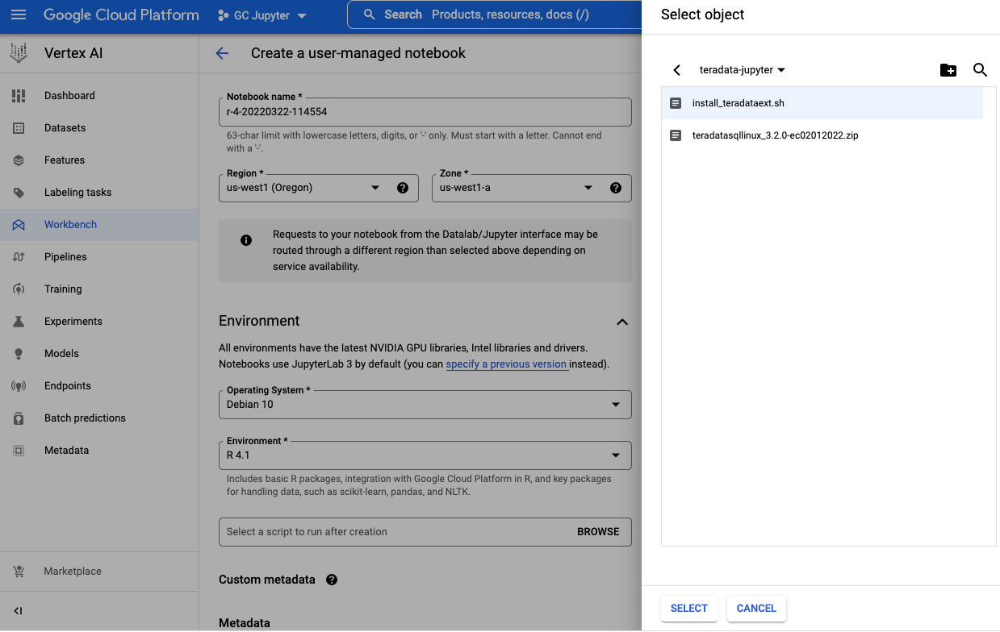
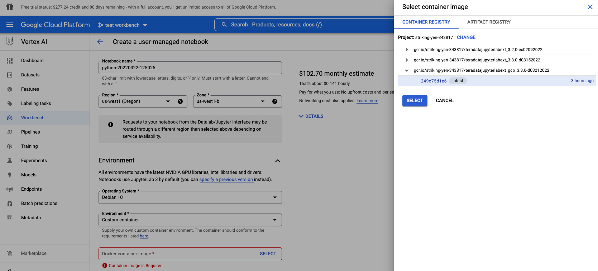

# Integrate Teradata Jupyter extensions with Google Vertex AI

import JupyterClearscapeNote from '../_partials/jupyter_notebook_clearscape_analytics_note.md';

<JupyterClearscapeNote />

### Overview
Teradata Jupyter extensions provide Teradata SQL kernel and several UI extensions to allow users to easily access and navigate Teradata database from Jupyter envioronment. Google Vertex AI is Google Cloud's new unified ML platform. Vertex AI Workbench provides a Jupyter-base development environment for the entire data science workflow. This article describes how to integate our Jupyter extensions with Vertex AI Workbench so that Vertex AI users can take advantage of our Teradata extensions in their ML pipeline.

Vertex AI workbench supports two types of notebooks: managed notebooks and user-managed notebooks. Here we will focus on user-managed notebooks. We will show two ways to integrate our Jupyter extensions with user-managed notebooks: use startup script to install our kernel and extensions or use custom container.

### Prerequisites

import ClearscapeDocsNote from '../_partials/vantage_clearscape_analytics.md'

* Access to a Teradata Vantage instance
  <ClearscapeDocsNote />
* Google Cloud account with Vertex AI enabled
* Google cloud storage to store startup scripts and Teradata Jupyter extension package

### Integration

There are two ways to run Teradata Jupyter Extensions in Vertex AI:

1. [Use startup script](#use_startup_script)
2. [Use custom container](#use_custom_container)

These two integration methods are described below.

### Use startup script

When we create a new notebook instance, we can specify a startup script. This script runs only once after the instance is created. Here are the steps:

1. Download Teradata Jupyter extensions package
+
Go to [Vantage Modules for Jupyter](https://downloads.teradata.com/download/tools/vantage-modules-for-jupyter) page to download the Teradata Jupyter extensions package bundle Linux version.

2. Upload the package to a Google Cloud storage bucket

3. Write a startup script and upload it to cloud storage bucket
+
Below is a sample script. It fetches Teradata Jupyter extension package from cloud storage bucket and installs Teradata SQL kernel and extensions.
+
``` bash , role="content-editable"
#! /bin/bash

cd /home/jupyter
mkdir teradata
cd teradata
gsutil cp gs://teradata-jupyter/* .
unzip teradatasql*.zip

# Install Teradata kernel
cp teradatakernel /usr/local/bin

jupyter kernelspec install ./teradatasql --prefix=/opt/conda

# Install Teradata extensions
pip install --find-links . teradata_preferences_prebuilt
pip install --find-links . teradata_connection_manager_prebuilt
pip install --find-links . teradata_sqlhighlighter_prebuilt
pip install --find-links . teradata_resultset_renderer_prebuilt
pip install --find-links . teradata_database_explorer_prebuilt

# PIP install the Teradata Python library
pip install teradataml

# Install Teradata R library (optional, uncomment this line only if you use an environment that supports R)
#Rscript -e "install.packages('tdplyr',repos=c('https://r-repo.teradata.com','https://cloud.r-project.org'))"
```


4. Create a new notebook and add the startup script from cloud storage bucket


5. It may take a few minutes for the notebook creation process to complete. When it is done, click on `Open notebook`.


### Use custom container

Another option is to provide a custom container when creating a notebook.

1. Download Teradata Jupyter extensions package
+
Go to [Vantage Modules for Jupyter](https://downloads.teradata.com/download/tools/vantage-modules-for-jupyter) page to download the Teradata Jupyter extensions package bundle Linux version.

2. Copy this package to your work directory and unzip it

3. Build custom Docker image
+
The custom container must expose a service on port 8080. It is recommended to create a container derived from a Google Deep Learning Containers image, because those images are already configured to be compatible with user-managed notebooks.
+
Below is a sample Dockerfile you can use to build a Docker image with Teradata SQL kernel and extensions installed:
+
``` bash
# Use one of the deep learning images as base image
# if you need both Python and R, use one of the R images
FROM gcr.io/deeplearning-platform-release/r-cpu:latest

USER root

##############################################################
# Install kernel and copy supporting files
##############################################################

# Copy the kernel
COPY ./teradatakernel /usr/local/bin

RUN chmod 755 /usr/local/bin/teradatakernel

# Copy directory with kernel.json file into image
COPY ./teradatasql teradatasql/

# Copy notebooks and licenses
COPY ./notebooks/ /home/jupyter
COPY ./license.txt /home/jupyter
COPY ./ThirdPartyLicenses/ /home/jupyter

# Install the kernel file to /opt/conda jupyter lab instance
RUN jupyter kernelspec install ./teradatasql --prefix=/opt/conda

##############################################################
# Install Teradata extensions
##############################################################

RUN pip install --find-links . teradata_preferences_prebuilt && \
    pip install --find-links . teradata_connection_manager_prebuilt && \
    pip install --find-links . teradata_sqlhighlighter_prebuilt && \
    pip install --find-links . teradata_resultset_renderer_prebuilt && \
    pip install --find-links . teradata_database_explorer_prebuilt

# Give back ownership of /opt/conda to jovyan
RUN chown -R jupyter:users /opt/conda

# PIP install the Teradata Python libraries
RUN pip install teradataml

# Install Teradata R library (optional, include it only if you use a base image that supports R)
RUN Rscript -e "install.packages('tdplyr',repos=c('https://r-repo.teradata.com','https://cloud.r-project.org'))"
```

4. In your work directory (where you unzipped Teradata Jupyter extensions package), run `docker build` to build the image:
+
``` bash , id="jupyterlab_ext_on_vertex_first_run", role="content-editable emits-gtm-events
docker build -f Dockerfile imagename:imagetag .
```

5. Push the docker image to Google container registry or artifact registry
+
Please refer to the following documentations to push docker image to registry:
+
* [Container Registry: Pushing and pulling images](https://cloud.google.com/container-registry/docs/pushing-and-pulling)
* [Artifact Registry: Pushing and pulling images](https://cloud.google.com/artifact-registry/docs/docker/pushing-and-pulling?hl=en)

6. Create a new notebook
+
In `Environment` section, set `custom container` field to the location of your newly created custom container:


### Further reading
* [Teradata Jupyter Extensions Website](https://teradata.github.io/jupyterextensions)
* [Teradata Vantage™ Modules for Jupyter Installation Guide](https://docs.teradata.com/r/KQLs1kPXZ02rGWaS9Ktoww/root)
* [Teradata® Package for Python User Guide](https://docs.teradata.com/r/1YKutX2ODdO9ppo_fnguTA/root)
* [Vertex AI documentation: Create a custom container image for training](https://cloud.google.com/vertex-ai/docs/training/create-custom-container)
* [Vertex AI documentation: Create a user-managed notebooks instance by using a custom container](https://cloud.google.com/vertex-ai/docs/workbench/user-managed/custom-container)
* [Vertex AI documentation: Create a user-managed notebooks instance](https://cloud.google.com/vertex-ai/docs/workbench/user-managed/create-new)

import CommunityLinkPartial from '../_partials/community_link.md';

<CommunityLinkPartial />
