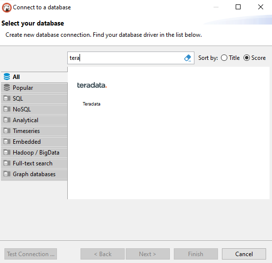
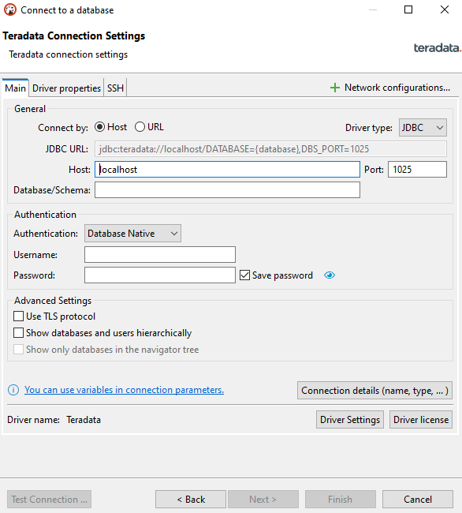

# Configure a Teradata Vantage connection in DBeaver

## Overview

This how-to demonstrates how to create a connection to Teradata Vantage with DBeaver.

## Prerequisites

import ClearscapeDocsNote from '../_partials/vantage_clearscape_analytics.mdx'

* Access to a Teradata Vantage instance.
  <ClearscapeDocsNote />
* DBeaver installed. See [DBeaver Community](https://dbeaver.io/download) or [DBeaver PRO](https://dbeaver.com/download) for installation options.

## Add a Teradata connection to DBeaver

1. Start the new connection wizard by clicking on the plug icon () in the upper left corner of the application window or go to `Database -> New Database Connection`.
2. On `Select your database` screen, start typing `teradata` and select the Teradata icon.

3. On the main tab, you need to set all primary connection settings. The required ones include `Host`, `Port`, `Database`, `Username`, and `Password`.

:::tip
In Teradata Vantage, when a user is created a corresponding database with the same is created as well. DBeaver requires that you enter the database. If you don't know what database you want to connect to, use your username in the `database` field.
:::

:::tip
With DBeaver PRO, you can not only use the standard ordering of tables but also hierarchically link tables to a specific database or user. Expanding and collapsing the databases or users will help you navigate from one area to another without swamping the Database Navigator window. Check the `Show databases and users hierarchically` box to enable this setting.
:::

:::tip
In many environments Teradata Vantage can only be accessed using the TLS protocol. When in DBeaver PRO, check `Use TLS protocol` option to enable TLS.
:::

4. Click on `Finish`.

## Optional: Logon Mechanisms

The default logon mechanism when creating a DBeaver connection is TD2. To add other logon mechanisms, follow the steps below:

1. Navigate to the database menu and click on Driver Manager.
2. From the list of driver names, select Teradata and click "Copy".
  

3. In the "URL Template" field, define your selected logon mechanism.
  `jdbc:teradata://\{host}/LOGMECH=LDAP,DATABASE=\{database},DBS_PORT=\{port}` 
  

4. Click "OK".
5. The new driver is now available to create connections with the selected logon mechanism.
  
6. The process for setting up a new connection with the alternative mechanism is the same as described above for adding a new connection.
  

## Optional: SSH tunneling

If your database cannot be accessed directly, you can use an SSH tunnel. All settings are available on the `SSH` tab. DBeaver supports the following authentication methods: user/password, public key, SSH agent authentication.

## Summary

This how-to demonstrated how to create a connection to Teradata Vantage with DBeaver.

import CommunityLinkPartial from '../_partials/community_link.mdx';

<CommunityLinkPartial />
