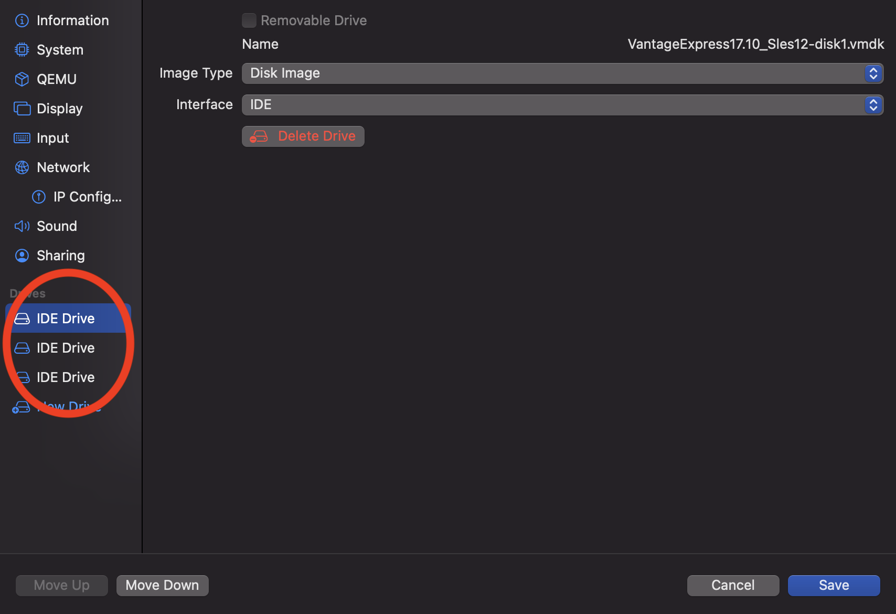

import GettingStartedIntro from '../../_partials/getting-started-intro.mdx';
import RunVantage from '../../_partials/run-vantage.mdx';
import RunSimpleQueries from '../../_partials/running-sample-queries.mdx';
import GettingStartedSummary from '../../_partials/getting-started-summary.mdx';
import CommunityLink from '../../_partials/community_link.mdx';

# Run Vantage Express on UTM

<GettingStartedIntro />

## Prerequisites

1. A Mac computer. Both Intel and M1/2 chips are supported.

:::note
Vantage Express runs on x86 architecture. When you run the VM on M1/2 chips, UTM has to emulate x86. This is significantly slower then virtualization. If you determine that Vantage Express on M1/M2 is too slow for your needs, consider running Vantage Express in the cloud: [AWS](../on-your-cloud-infrastructure/run-vantage-express-on-aws.md), [Azure](../on-your-cloud-infrastructure/run-vantage-express-on-microsoft-azure.md), [Google Cloud](../on-your-cloud-infrastructure/vantage-express-gcp.md).
:::

2. 30GB of disk space and enough CPU and RAM to be able to dedicate at least one core and 4GB RAM to the virtual machine.
3. Admin rights to be able to install and run the software.

:::note
No admin rights on your local machine? Have a look at how to run Vantage Express in [AWS](../on-your-cloud-infrastructure/run-vantage-express-on-aws.md), [Azure](../on-your-cloud-infrastructure/run-vantage-express-on-microsoft-azure.md), [Google Cloud](../on-your-cloud-infrastructure/vantage-express-gcp.md).
:::

## Installation

### Download required software

1. The latest version of [Vantage Express](https://downloads.teradata.com/download/database/teradata-express-for-vmware-player). If you have not used the Teradata downloads website before, you will need to register.
2. The latest version of [UTM](https://mac.getutm.app).

### Run UTM installer

1. Install UTM by running the installer and accepting the default values.

### Run Vantage Express

1. Go to the directory where you downloaded Vantage Express and unzip the downloaded file.
2. Start UTM, click on the `+` sign and select `Virtualize` (for Intel Macs) or `Emulate` (for M1 Macs).
3. On `Operating System` screen select `Other`.
4. On `Other` screen select `Skip ISO Boot`.
5. On `Hardware` screen allocate at least 4GB of memory and at least 1 CPU core. We recommend 10GB RAM and 2 CPUs.

    

6. On `Storage` screen accept the defaults by clicking `Next`.
7. On `Shared Direct` screen click `Next`.
8. On `Summary` screen check `Open VM Settings` and click `Save`.
9. Go through the setup wizard. You only need to adjust the following tabs:
    - **QEMU** - disable `UEFI Boot` option
    - **Network** - expose ssh (22) and Vantage (1025) ports on the host computer:

    

10. Map drives:
    * Delete the default `IDE Drive`.
    * Map the 3 Vantage Express drives by importing the disk files from the downloaded VM zip file. Make sure you map them in the right order, `-disk1`, `-disk2`, `-disk3` . The first disk is bootable and contains the database itself. Disks 2 and 3 are so called `pdisks` and contain data. As you import the files UTM will automatically convert them fro `vmdk` into `qcow2` format. Make sure that each disk is configured using the `IDE` interface:

    

    * Once you are done mapping all 3 drives, your configuration should look like this:

    

11. Save the configuration and start the VM.

<RunVantage />

<RunSimpleQueries />

<GettingStartedSummary />

## Next steps
* [Query data stored in object storage](../../manage-data/nos.md)

## Further reading
* [Teradata® Studio™ and Studio™ Express Installation Guide](https://docs.teradata.com/r/Teradata-StudioTM-and-StudioTM-Express-Installation-Guide-17.20)

<CommunityLink />
