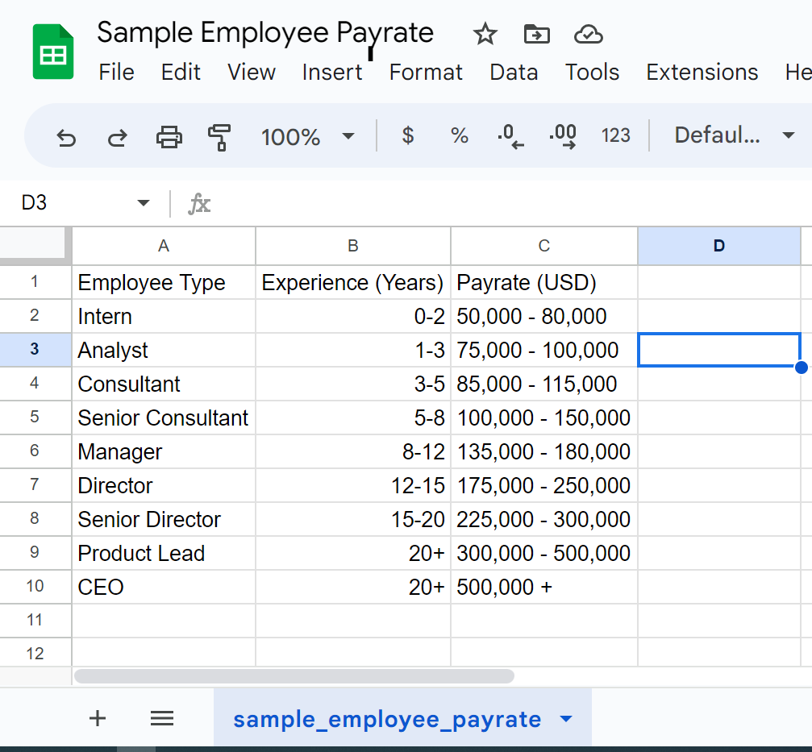
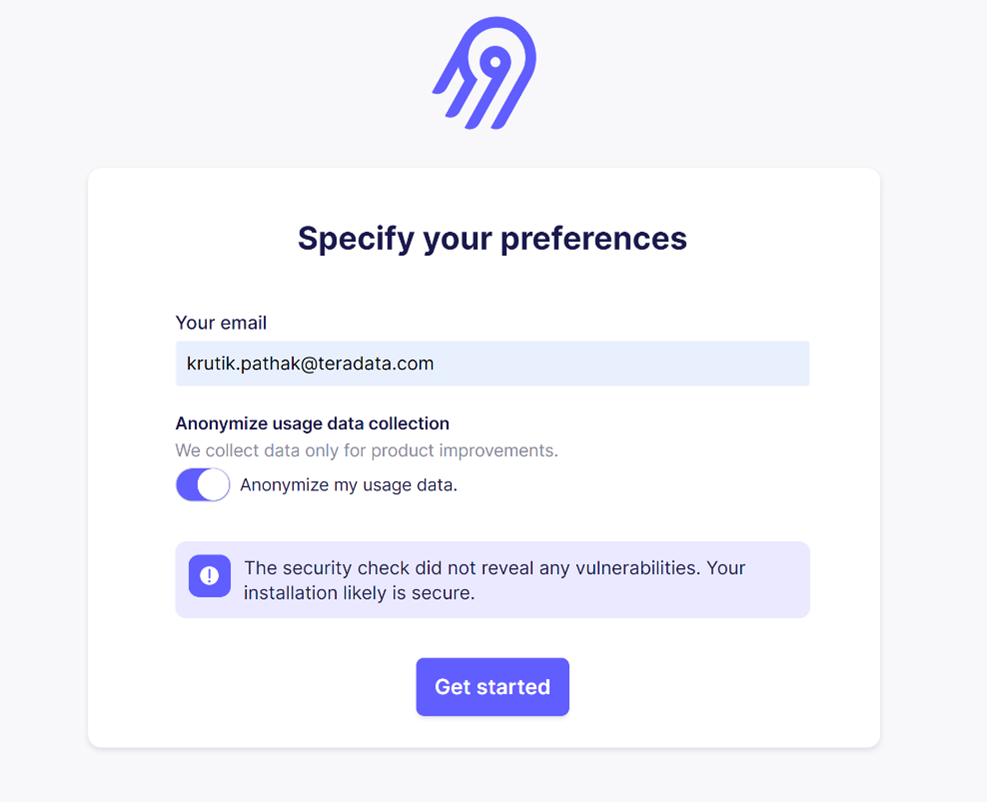
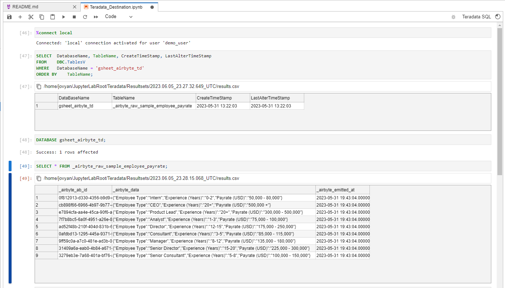
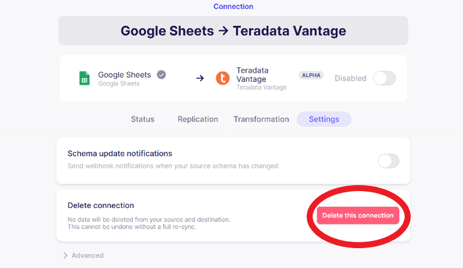

# Use Airbyte to load data from external sources to Teradata Vantage


## Overview

This tutorial showcases how to use Airbyte to move data from sources to Teradata Vantage, detailing both the [Airbyte Open Source](https://docs.airbyte.com/using-airbyte/getting-started) and [Airbyte Cloud options](https://airbyte.com). This specific example covers replication from Google Sheets to Teradata Vantage.

* Source: Google Sheets
* Destination: Teradata Vantage



## Prerequisites

import ClearscapeDocsNote from '../_partials/vantage_clearscape_analytics.mdx'

* Access to a Teradata Vantage Instance. This will be defined as the destination of the Airbyte connection. You will need a database `Host`, `Username`, and `Password` for Airbyte’s configuration.
        <ClearscapeDocsNote />

* [Google Cloud Platform API enabled for your personal or organizational account](https://support.google.com/googleapi/answer/6158841?hl=en). You’ll need to authenticate your Google account via OAuth or via Service Account Key Authenticator. In this example, we use Service Account Key Authenticator.

* Data from the source system. In this case, we use a [sample spreadsheet from google sheets](https://docs.google.com/spreadsheets/d/1XNBYUw3p7xG6ptfwjChqZ-dNXbTuVwPi7ToQfYKgJIE/edit). The sample data is a breakdown of payrate by employee type.

### Airbyte Cloud
* Create an account on [Airbyte Cloud](https://airbyte.com) and skip to the instructions under the [Airbyte Configuration](#airbyte-configuration) section.

### Airbyte Open Source
* Install Docker Compose to run [Airbyte Open Source](https://github.com/airbytehq/airbyte) locally. Docker Compose comes with Docker Desktop. Please refer to [docker docs](https://docs.docker.com/compose/install) for more details. 

* Clone the Airbyte Open Source repository and go to the airbyte directory.

        ``` bash
        git clone --depth 1 https://github.com/airbytehq/airbyte.git
        cd airbyte
        ```

Make Sure to have Docker Desktop running before running the shell script `run-ab-platform`.

* Run the shell script `run-ab-platform` as


        ``` bash
        ./run-ab-platform.sh
        ```


        :::note
        You can run the above commands with `git bash` in Windows. Please refer to the [Airbyte Local Deployment](https://docs.airbyte.com/deploying-airbyte/local-deployment) for more details. 
        :::

* Log in to the web app http://localhost:8000/ by entering the default credentials found in the `.env` file included in the repository.


        ``` bash
        BASIC_AUTH_USERNAME=airbyte
        BASIC_AUTH_PASSWORD=password
        ```


When logging in for the first time, Airbyte will prompt you to provide your email address and specify your preferences for product improvements. Enter your preferences and click on "Get started."



Once Airbyte Open Source is launched you will see a connections dashboard. If you launched Airbyte Open Source for the first time, it would not show any connections.

## Airbyte Configuration

### Setting the Source Connection
* You can either click "Create your first connection" or click on the top right corner to initiate the new connection workflow on Airbyte's Connections dashboard.


* Airbyte will ask you for the Source, you can select from an existing source (if you have set it up already) or you can set up a new source, in this case we select `Google Sheets`.

* For authentication we are using `Service Account Key Authentication` which uses a service account key in JSON format. Toggle from the default `OAuth` to `Service Account Key Authentication`. To authenticate your Google account via Service Account Key Authentication, enter your [Google Cloud service account key](https://cloud.google.com/iam/docs/keys-create-delete#creating_service_account_keys) in JSON format. +
Make sure the Service Account has the Project Viewer permission. If your spreadsheet is viewable by anyone with its link, no further action is needed. If not, [give your Service account access to your spreadsheet](https://www.youtube.com/watch?v=GyomEw5a2NQ).

* Add the link to the source spreadsheet as `Spreadsheet Link`.


:::note
For more details, please refer [Setting Google Sheets as Source Connector in Airbyte Open Source](https://docs.airbyte.com/integrations/sources/google-sheets/#:~:text=For%20Airbyte%20Open%20Source%3A) 
:::

* Click Set up source, if the configuration is correct, you will get the message `All connection tests passed!`


### Setting the Destination Connection
* Assuming you want to create a fresh new connection with `Teradata Vantage`, Select `Teradata Vantage` as the destination type under the "Set up the destination" section.
* Add the `Host`, `User`, and `Password`. These are the same as the `Host`, `Username`, and `Password` respectively, used by your Clearscape Analytics Environment.
* Provide a default schema name appropriate to your specific context. Here we have provided `gsheet_airbyte_td`.

:::note
If you do not provide a `Default Schema`, you will get an error stating "Connector failed while creating schema". Make sure you provide appropriate name in the `Default Schema`.
:::


* Click Set up destination, if the configuration is correct, you will get the message `All connection tests passed!`


:::note
You might get a configuration check failed error. Make sure your Teradata Vantage instance is running properly before making a connection through Airbyte. 
:::

### Configuring Data Sync
A namespace is a group of streams [tables) in a source or destination. A schema in a relational database system is an example of a namespace. In a source, the namespace is the location from where the data is replicated to the destination. In a destination, the namespace is the location where the replicated data is stored in the destination.
For more details please refer to [Airbyte Namespace](https://docs.airbyte.com/understanding-airbyte/namespaces)


In our example the destination is a database, so the namespace is the default schema `gsheet_airbyte_td` we defined when we configured the destination. The stream name is a table that is mirroring the name of the spreadsheet in the source, which is `sample_employee_payrate` in this case. Since we are using the single spreadsheet connector, it only supports one stream [the active spreadsheet). 

Other type of sources and destinations might have a different layout. In this example, Google sheets, as source, does not support a namespace. 
In our example, we have used `<destination schema>` as the Namespace of the destination, this is the default namespace assigned by Airbyte based on the `Default Schema` we declared in the destination settings. The database `gsheet_airbyte_td` will be created in our Teradata Vantage Instance.

:::note
We use the term "schema", as it is the term used by Airbyte. In a Teradata context the term "database" is the equivalent.
:::

#### Replication Frequency
It shows how often data should sync to destination. You can select every hour, 2 hours, 3 hours etc. In our case we used every 24 hours. 


You can also use a Cron expression to specify the time when the sync should run. In the example below, we set the Cron expression to run the sync on every Wednesday at 12:43 PM (US/Pacific) time.


### Data Sync Validation

Airbyte tracks synchronization attempts in the "Sync History" section of the `Status` tab. 


Next, you can go to the [ClearScape Analytics Experience](https://clearscape.teradata.com/dashboard) and run a Jupyter notebook, notebooks in ClearScape Analytics Experience are configured to run Teradata SQL queries, to verify if the database `gsheet_airbyte_td`, streams (tables) and complete data is present.



``` bash
%connect local 
```

``` bash , id="airbyte_select_query", role="emits-gtm-events"
SELECT  DatabaseName, TableName, CreateTimeStamp, LastAlterTimeStamp
FROM    DBC.TablesV
WHERE   DatabaseName = 'gsheet_airbyte_td'
ORDER BY    TableName;
```

``` bash
DATABASE gsheet_airbyte_td; 
```

``` bash
SELECT * FROM _airbyte_raw_sample_employee_payrate;  
```

The stream (table) name in destination is prefixed with `\_airbyte_raw_` because Normalization and Transformation are not supported for this connection, and [we only have the raw table](https://docs.airbyte.com/understanding-airbyte/namespaces/#:~:text=If%20you%20don%27t%20enable%20basic%20normalization%2C%20you%20will%20only%20receive%20the%20raw%20tables). Each stream (table) contains 3 columns: 

1. `_airbyte_ab_id`: a uuid assigned by Airbyte to each event that is processed. The column type in Teradata is `VARCHAR(256)`.

2. `_airbyte_emitted_at`: a timestamp representing when the event was pulled from the data source. The column type in Teradata is `TIMESTAMP(6)`.

3. `_airbyte_data`: a json blob representing the event data. The column type in Teradata is `JSON`.

Here in the `_airbyte_data` column, we see 9 rows, the same as we have in the source Google sheet, and the data is in JSON format which can be transformed further as needed.

### Close and delete the connection

* You can close the connection in Airbyte by disabling the connection. This will stop the data sync process.


* You can also delete the connection.




### Summary
This tutorial demonstrated how to extract data from a source system like Google sheets and use the Airbyte ELT tool to load the data into the Teradata Vantage Instance. We saw the end-to-end data flow and complete configuration steps for running Airbyte Open Source locally, and configuring the source and destination connections. We also discussed about the available data sync configurations based on replication frequency. We validated the results in the destination using Cloudscape Analytics Experience and finally we saw the methods to pause and delete the Airbyte connection. 

### Further reading
[Teradata Destination | Airbyte Documentation](https://docs.airbyte.com/integrations/destinations/teradata/?_ga=2.156631291.1502936448.1684794236-1752661382.1684794236)

[Core Concepts | Airbyte Documentation,](https://docs.airbyte.com/cloud/core-concepts/#connection-sync-modes)

[Airbyte Community Slack](https://airbyte.com/community)

[Airbyte Community](https://discuss.airbyte.io)

