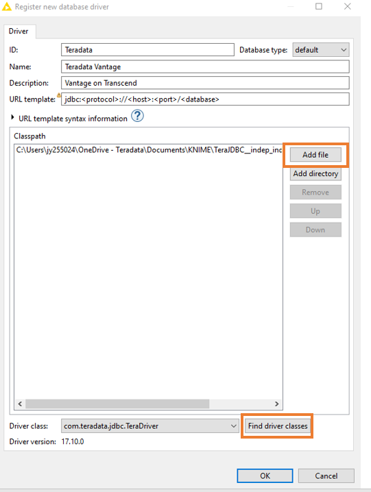
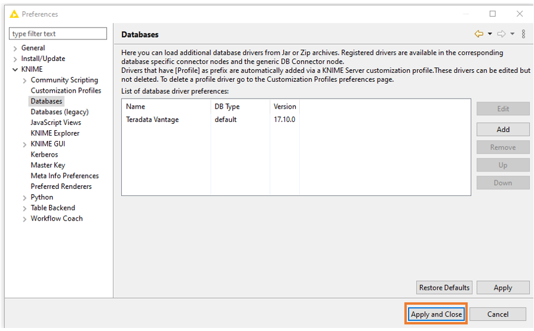
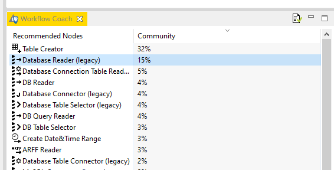
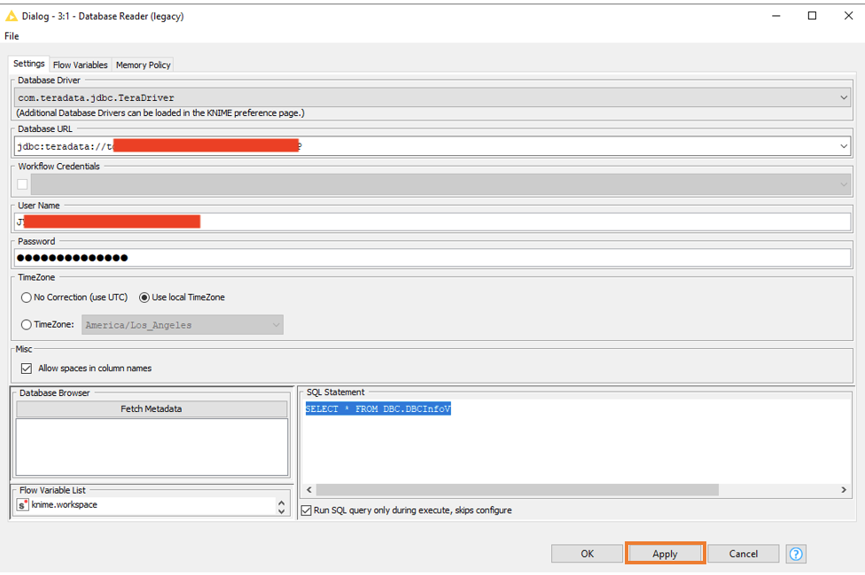

---
experimental:
page-author: Jeremy Yu
page-email: Jeremy.yu@teradata.com
page-revdate: May 18th, 2022
description: Integrate Teradata Vantage with KNIME.
keywords: [data warehouses, compute storage separation, teradata, vantage, cloud data platform, object storage, business intelligence, enterprise analytics]
---

# Integrate Teradata Vantage with KNIME Analytics Platform

## Overview

This how-to describes how to connect to Terdata Vantage from KNIME Analytics Platform.

### About KNIME Analytics Platform

KNIME Analytics Platform is a data science workbench. It supports analytics on various data sources, including Teradata Vantage.

## Prerequisites

import ClearscapeDocsNote from '../_partials/vantage_clearscape_analytics.md'

* Access to a Teradata Vantage instance, version 17.10 or higher.
  <ClearscapeDocsNote />
* KNIME installed locally. See [KNIME installation instructions](https://www.knime.com/installation) for details.

## Integration Procedure

1. Go to https://downloads.teradata.com/download/connectivity/jdbc-driver (first time users will need to register) and download the latest version of the JDBC driver.
2. Unzip the downloaded file. You will find `terajdbc4.jar` file.
3. In KNIME, click on `File → Preference`. Under `Databases`, click `Add`:

4. Register a new database driver. Provide values for `ID`, `Name` and `Description` like below. Click on `Add file` and point to the .jar file you downloaded earlier. Click on the `Find driver classes` and the `Driver class:` should populate with the `jdbc.TeraDriver`:

5. Click `Apply and Close`:

6. To test the connection, create a new KNIME workflow and add a `Database Reader (legacy)` node by dragging it to the workspace to the right:

7. Right-click on the `Database Reader (legacy)` to configure settings. Select `com.teradata.jdbc.Teradriver` from the drop-down:

8. Enter the name of the Vantage server and login mechanism, e.g.:

9. To test connection, enter SQL statement in box in lower right. For example, enter `SELECT * FROM DBC.DBCInfoV` and click `Apply` to close the dialog:

10. Execute the node to test the connection:

11. The node will show a green light when run successfully. Right-click and select `Data from Database` to view the results:

## Summary

This how-to demonstrats how to connect from KNIME Analytics Platform to Teradata Vantage.

## Further reading
* xref:ROOT:ml.adoc[Train ML models in Vantage using only SQL]

import CommunityLinkPartial from '../_partials/community_link.md';

<CommunityLinkPartial />