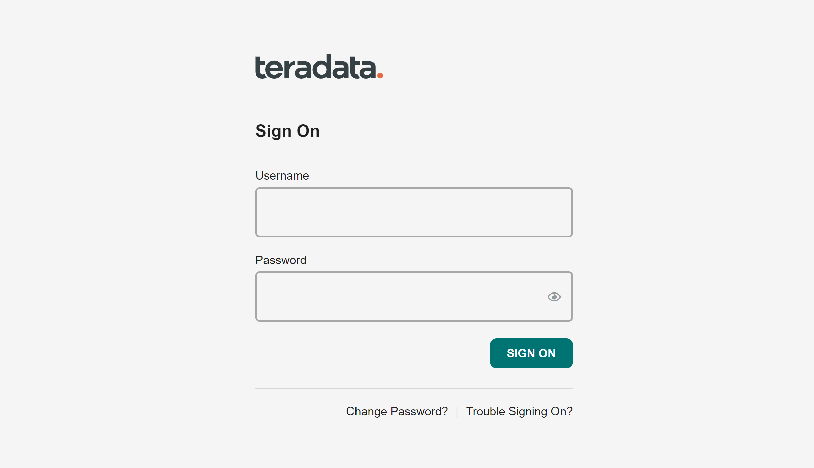
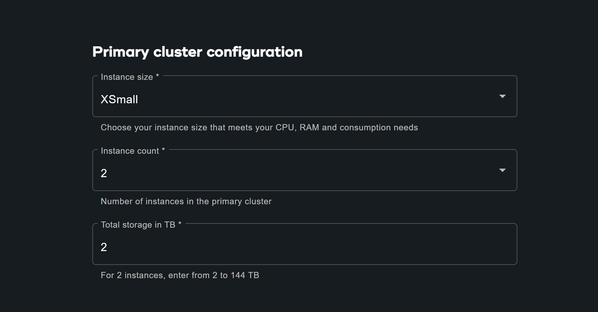
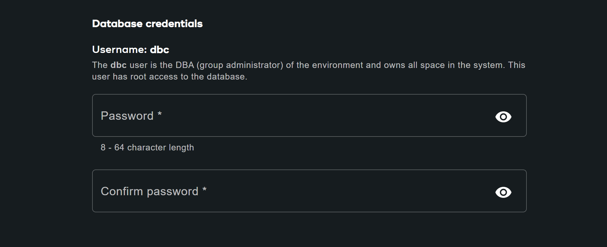
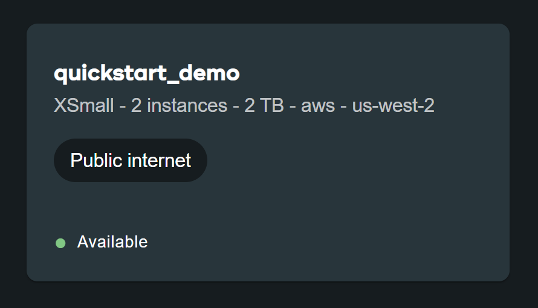

# Getting Started with VantageCloud Lake 

## Overview

Teradata VantageCloud Lake is Teradata's next-generation, cloud-native analytics and data platform. It provides lakehouse deployment patterns along with the ability to run independent elastic workloads using an object storage-centric design. 

It empowers organizations to unlock their data, activate analytics, and accelerate value. Customers can optimize their analytics environment using specially configured compute cluster resources that best accommodate their workload requirements. 


VantageCloud Lake provides all the benefits you’d expect in a cloud solution plus Teradata’s differentiated technology stack, including the industry-leading Analytics Database, ClearScape Analytics, and QueryGrid data fabric.

## Sign-on to VantageCloud Lake

:::important
To get a VantageCloud Lake sign-on link and credentials, fill the [contact form](https://www.teradata.com/about-us/contact) to reach out to Teradata team.   
:::

Go to the URL provided by Teradata, for example, **_ourcompany.innovationlabs.teradata.com_** and sign on:

* Existing customers can use their organization admin username(email address) and password to sign on.
* New customer can sign on with their organization admin username (from welcome letter: email address) and the password you created. 

:::note
Click [here](https://login.customer.teradata.com/ext/pwdreset/Identify?AdapterId=CDSCustomer) to reset the organization admin password.
:::



The signing on takes you to VantageCloud Lake welcome page.


The Welcome page has navigation menu that not only gives you a complete control of your environments but also provides you various necessary tools:


* Vantage - Home page of VantageCloud Lake portal
* [Environments](https://docs.teradata.com/r/Teradata-VantageCloud-Lake/Getting-Started-First-Sign-On-by-Organization-Admin/Step-1-Signing-On-and-Creating-Your-First-Environment) - Create your environments and see all the created environments
* [Organization](https://docs.teradata.com/r/Teradata-VantageCloud-Lake/Introduction-to-VantageCloud-Lake/VantageCloud-Lake-Organizations-and-Environments) - View organizations configuration, manage Organization Admins and view the configuration and status of your account
* [Consumption](https://docs.teradata.com/r/Teradata-VantageCloud-Lake/Managing-Compute-Resources/Review-Consumption-Usage) - Monitor how your organization consumes compute and storage resources
* [Cost Calculator](https://docs.teradata.com/r/Teradata-VantageCloud-Lake/Managing-Consumption/Using-the-Consumption-Estimates) - Calculate the cost and consumption of your environment and whole organization. 
* [Queries](https://docs.teradata.com/r/Teradata-VantageCloud-Lake/Running-and-Monitoring-Queries/Monitoring-and-Managing-Queries) - Inspect an environment's queries to understand their efficiency.
* [Editor](https://docs.teradata.com/r/Teradata-VantageCloud-Lake/Running-and-Monitoring-Queries) - Create and run queries in an editor.  
* [Data Copy](https://docs.teradata.com/r/Teradata-VantageCloud-Lake/Data-Copy) - Provision, configure and run data copy (also known as Data Mover) jobs from VantageCloud Lake Console.


## Create an Environment
To create a primary cluster environment, click on "Environments" on the navigation menu. In a new opened view, click on "Create" button situated on the top right of the page.


### Environment configuration

Fill out the Environment configuration fields:


| **Item**           | **Description**                                                                 |
|--------------------|---------------------------------------------------------------------------------|
| *Environment name* | A contextual name for new environment                                           |
| *Region*           | The available region list was predetermined during the sales process.            |
| *Package*          | There are dos service packages available to select from:                         |
|                    | - Lake: Premier 24x7 cloud support                                               |
|                    | - Lake: Premier 24x7 Priority cloud support + industry data models               |


:::important
The **Consumption estimates**, to your right, provide guidance for configuring the environment. See [Using the Consumption Estimates](https://docs.teradata.com/r/Teradata-VantageCloud-Lake/Managing-Consumption/Using-the-Consumption-Estimates) for more detail.   
:::

### Primary cluster configuration

Fill out the Primary cluster configuration fields:


```mdx-code-block

<table>
  <thead>
    <tr>
      <th>Item</th>
      <th>Description</th>
    </tr>
  </thead>
  <tbody>
    <tr>
      <td><em>Instance size</em></td>
      <td>
        Select an instance size suitable for your use-case:<br />
        <strong>Lake</strong>
        <table>
          <thead>
            <tr>
              <th>Size</th>
              <th>Value (in units)</th>
            </tr>
          </thead>
          <tbody>
            <tr>
              <td>XSmall</td>
              <td>2</td>
            </tr>
            <tr>
              <td>Small</td>
              <td>4</td>
            </tr>
            <tr>
              <td>Medium</td>
              <td>7</td>
            </tr>
            <tr>
              <td>Large</td>
              <td>10</td>
            </tr>
            <tr>
              <td>XLarge</td>
              <td>13</td>
            </tr>
            <tr>
              <td>2XLarge</td>
              <td>20</td>
            </tr>
            <tr>
              <td>3XLarge</td>
              <td>27</td>
            </tr>
          </tbody>
        </table>
        <strong>Lake+</strong>
        <table>
          <thead>
            <tr>
              <th>Size</th>
              <th>Value (in units)</th>
            </tr>
          </thead>
          <tbody>
            <tr>
              <td>XSmall</td>
              <td>2.4</td>
            </tr>
            <tr>
              <td>Small</td>
              <td>4.8</td>
            </tr>
            <tr>
              <td>Medium</td>
              <td>8.4</td>
            </tr>
            <tr>
              <td>Large</td>
              <td>12</td>
            </tr>
            <tr>
              <td>XLarge</td>
              <td>15.6</td>
            </tr>
            <tr>
              <td>2XLarge</td>
              <td>24</td>
            </tr>
            <tr>
              <td>3XLarge</td>
              <td>32.4</td>
            </tr>
          </tbody>
        </table>
      </td>
    </tr>
    <tr>
      <td><em>Instance count</em></td>
      <td>2 to 64<br />Number of nodes in the primary clusters</td>
    </tr>
    <tr>
      <td><em>Instance storage</em></td>
      <td>1 to 72TB per instance</td>
    </tr>
  </tbody>
</table>


```




### Database credentials

Fill out the Database credential fields:

| **Item**           | **Description**                                                                 |
|--------------------|---------------------------------------------------------------------------------|
| DBC password | The primary administrative account in a Teradata Vantage environment is known as "dbc". Similar to the root user in Linux, the dbc account holds comprehensive administrative privileges. It is recommended to establish additional administrative users for routine tasks, after the environment is created, and to refrain from sharing or utilizing the dbc credentials. |

Set the password for dbc: 
* Between 8 and 64 characters 
* Allows both alphanumeric and special characters 
* No dictionary words 




### Advanced options

To quickly get started, you can select **Use Defaults** or define the additional option settings.


```mdx-code-block
| *Item*           |Description*                                                                                   |
|-------------|---------------------------------------------------------------------------------------------------|
| AMPs per instance       | Workload management + Select the number of AMPs per instance for the instance size you selected. |
| AWS: Storage encryption | Configure encryption for customer data. See [Finding the key ID and key ARN](https://docs.aws.amazon.com/kms/latest/developerguide/find-cmk-id-arn.html) <br/> <ul><li>Managed by Teradata</li><li>Customer managed</li><li>Key Alias ARN</li></ul>  |

```


Review all the information and click on **CREATE ENVIRONMENT** button.


The deployment takes few minutes. Once complete, created environment can be found in **Environments** section as a card view(name of environment is quickstart_demo). 


## Access environment from public internet

The created environment is accessible through console only. To change that, click on created environment and go to *SETTINGS* tab.


In the **SETTINGS**, select the **Internet connection** checkbox and provide the IP addresses in CIDR format (for example, 192.168.2.0/24 specifies all IP addresses in the range: 192.168.2.0 to 192.168.2.255) with which you would want to access your environment. 

:::note
Find more information on setting up an internet connection [here](https://docs.teradata.com/r/Teradata-VantageCloud-Lake/Getting-Started-First-Sign-On-by-Organization-Admin/Step-2-Setting-the-Environment-Connection-Type/Setting-Up-an-Internet-Connection).
:::


Click on the **SAVE** button situated on right top of the page to confirm changes. 

Go back to the **Environments** section and check your environment card. It has **Public internet** access now.




## Summary

In this quick start we learned how to create an environment in VantageCloud Lake and allow it to be accessed from public internet.

## Further reading

* [Teradata VantageCloud Lake documentation](https://docs.teradata.com/r/Teradata-VantageCloud-Lake/Getting-Started-First-Sign-On-by-Organization-Admin)