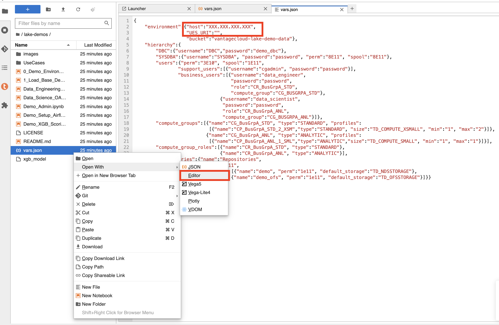

# Run Teradata Jupyter Notebook Demos for VantageCloud Lake in Google Cloud Vertex AI  

## Overview
This quickstart explains how to run [Teradata Jupyter Notebook Demos for VantageCloud Lake](https://github.com/Teradata/lake-demos) on Vertex AI, the AI/ML platform for Google Cloud. 

## Prerequisites
* Teradata modules for Jupyter **Linux desktop version** (download [here](https://downloads.teradata.com/download/tools/vantage-modules-for-jupyter), registration required)
* Google Cloud account with [Vertex AI and Notebooks API](https://console.cloud.google.com/flows/enableapi?apiid=notebooks.googleapis.com,aiplatform.googleapis.com&redirect=https://console.cloud.google.com&_ga=2.180323111.284679914.1706204112-1996764819.1705688373) enabled
* Google cloud storage to store startup scripts and Teradata Jupyter extension package
* [Access to a VantageCloud Lake environment](https://quickstarts.teradata.com/getting-started-with-vantagecloud-lake.html)

## Vertex AI Google Cloud environment setup

When you create a new notebook instance, you can specify a startup script. This script, which runs only once after instance creation, will install the Teradata Jupyter extension package and clone a GitHub repository into the new user-managed notebooks instance.

* Download Teradata Jupyter extensions package
    * Visit [Vantage Modules for Jupyter page](https://downloads.teradata.com/download/tools/vantage-modules-for-jupyter)
    * Sign in and download the Teradata Linux version of the package.

* Create Google Cloud Storage Bucket 
     - Create a bucket with a name relevant to the project (e.g., teradata_jupyter). 
     - Ensure that the bucket name is globally unique. For instance, if the name teradata_jupyter has already been used, it will not be available for subsequent users. 


* Upload the unizzped Jupyter extension package to your Google Cloud Storage bucket as a file.

* Write the following startup script and save it as `startup.sh` to your local machine. 

Below is an example script that retrieves the Teradata Jupyter extension package from Google Cloud Storage bucket and installs Teradata SQL kernel, extensions and clones the lake-demos repository. 

:::info
Remember to replace teradata_jupyter in the gsutil cp command.
:::

``` bash , id="vertex_ex_script", role="content-editable, emits-gtm-events"
#! /bin/bash

cd /home/jupyter
mkdir teradata
cd teradata
gsutil cp gs://teradata_jupyter/* .
unzip teradatasql*.zip

# Install Teradata kernel
cp teradatakernel /usr/local/bin

jupyter kernelspec install ./teradatasql --prefix=/opt/conda

# Install Teradata extensions
pip install --find-links . teradata_preferences_prebuilt
pip install --find-links . teradata_connection_manager_prebuilt
pip install --find-links . teradata_sqlhighlighter_prebuilt
pip install --find-links . teradata_resultset_renderer_prebuilt
pip install --find-links . teradata_database_explorer_prebuilt

# PIP install the Teradata Python library
pip install teradataml==17.20.00.04

# Install Teradata R library (optional, uncomment this line only if you use an environment that supports R)
#Rscript -e "install.packages('tdplyr',repos=c('https://r-repo.teradata.com','https://cloud.r-project.org'))"

# Clone the Teradata lake-demos repository
su - jupyter -c "git clone https://github.com/Teradata/lake-demos.git"
```
* Upload this script to your Google Cloud storage bucket as a file


### Initiating a user managed notebook instance

* Access Vertex AI Workbench
    - Return to Vertex AI Workbench in Google Cloud console.
    - Create a new User-Managed Notebook via Advanced Options or directly at https://notebook.new/.

* Under Details, name your notebook, select your region and select continue.


* Under Environment select **Browse** to select your startup.sh script from your Google Cloud Bucket.


* Select Create to initiate the notebook. It may take a few minutes for the notebook creation process to complete. When it is done, click on OPEN JUPYTERLAB. 


:::info
You will have to whitelist this IP in your VantageCloud Lake environment to allow the connection. This solution is appropriate in a trial environment. For production environments, a configuration of VPCs, Subnets, and Security Groups might need to be configured and whitelisted.
:::

* On JupyterLab open a notebook with a Python kernel and run the following command for finding your notebook instance IP address.


``` python , role="content-editable"
import requests
def get_public_ip():
    try:
        response = requests.get('https://api.ipify.org')
        return response.text
    except requests.RequestException as e:
        return "Error: " + str(e)
my_public_ip = get_public_ip()
print("My Public IP is:", my_public_ip)
```

## VantageCloud Lake Configuration
* In the VantageCloud Lake environment, under settings, add the IP of your notebook instance


## Edit vars.json
Navigate into the `lake-demos` directory in your notebook. 


Right click on vars.json to open the file with editor. 



Edit the *[vars.json file](https://github.com/Teradata/lake-demos/blob/main/vars.json)* file to include the required credentials to run the demos 

|*Variable* | *Value*|
|---------|----------|
|*"host"* | Public IP value from your VantageCloud Lake environment |
| *"UES_URI"*| Open Analytics from your VantageCloud Lake environment |
| *"dbc"*| The master password of your VantageCloud Lake environment. |

To retrieve a Public IP address and Open Analytics Endpoint follow these [instructions](https://quickstarts.teradata.com/vantagecloud-lake/vantagecloud-lake-demo-jupyter-docker.html#_create_vantagecloud_lake_environment).

:::info
Change passwords in the vars.json file.You'll see that in the sample vars.json, the passwords of all users are defaulted to "password", this is just for matters of the sample file, you should change all of these password fields to strong passwords, secure them as necessary and follow other password management best practices
:::

## Run demos
Execute all the cells in *0_Demo_Environment_Setup.ipynb* to setup your environment. Followed by *1_Demo_Setup_Base_Data.ipynb* to load the base data required for demo.

To learn more about the demo notebooks, go to [Teradata Lake demos](https://github.com/Teradata/lake-demos) page on GitHub.

## Summary 
In this quickstart guide, we configured Google Cloud Vertex AI Workbench Notebooks to run [Teradata Jupyter Notebook Demos for VantageCloud Lake](https://github.com/Teradata/lake-demos).